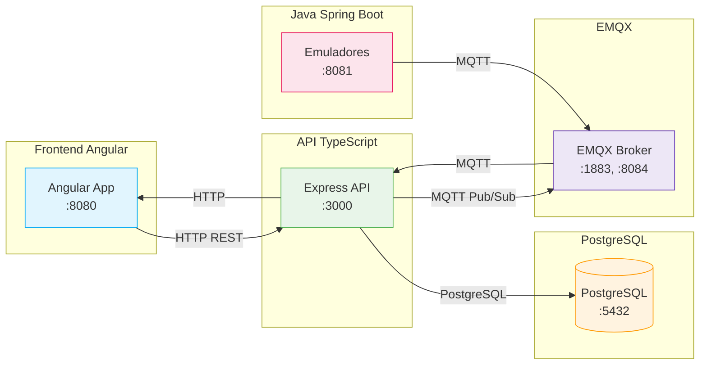

# 🌬️ SafeAir: Sistema de Monitoreo de Calidad de Aire y Climatización

SafeAir es una plataforma de IoT diseñada para el monitoreo y control de la calidad del aire en espacios cerrados. El sistema procesa mediciones ambientales en tiempo real y permite el control bidireccional de dispositivos (actuadores).

## 📋 Descripción del Proyecto

**SafeAir** es un sistema distribuido que demuestra arquitecturas modernas de comunicación en red:

- **Frontend**: Interfaz Angular 19 para visualización y control
- **API/Backend**: TypeScript/Node.js/Express con persistencia PostgreSQL
- **Broker MQTT**: EMQX (no Mosquitto) para comunicación pub/sub
- **Emuladores**: Java Spring Boot simulando dispositivos IoT
- **Base de datos**: PostgreSQL 16

---

## 🏗️ Arquitectura del Sistema



---

## 📊 Flujos de Datos

### Telemetría (Emulador → Frontend)
```
Emulador Java → EMQX (:1883) → API → PostgreSQL → Frontend
```

### Control (Frontend → Emulador)
```
Frontend → API → PostgreSQL → EMQX → Emulador Java
```

### Consulta
```
Frontend → API → PostgreSQL → Frontend
```

---

## 🚀 Inicio Rápido

### Prerrequisitos
- Docker y Docker Compose instalados
- Puertos libres: 3000, 5432, 6543, 8080, 8081, 1883, 8084, 18083

### Ejecución en una máquina

```bash
# 1.进入 proyecto
cd /home/jbenitez/DSR_Jorge/Proyecto

# 2. Configurar modo demo (sin OTP)
echo "AUTH_SKIP_OTP=true" >> .env

# 3. Levantar servicios
docker compose up -d --build

# 4. Verificar servicios
docker compose ps
```

### URLs de Acceso

| Servicio | URL |
|----------|-----|
| **Frontend** | http://localhost:8080 |
| **API** | http://localhost:3000 |
| **API Health** | http://localhost:3000/health |
| **Logs Visuales** | http://localhost:3000/debug/logs.html |
| **Emuladores** | http://localhost:3000/debug/emulators.html |
| **EMQX Dashboard** | http://localhost:18083 |

### Credenciales por Defecto
- Email: `admin@safeair.io`
- Password: `admin123`

---

## 📁 Estructura del Proyecto

```
SafeAir/
├── Frontend_SafeAir/          # Frontend Angular 19
├── Api_Emuladores/             # API TypeScript/Node.js
├── SafeAir-System-Emulator/    # Emulador Java Spring Boot
├── specs/                     # Documentación técnica
├── docker-compose.yml         # Orquestación Docker
├── .env.docker               # Variables Docker
└── README.md                  # Este archivo
```

---

## 🔧 Componentes

### Frontend (Angular)
Documentación: [Frontend_SafeAir/README.md](Frontend_SafeAir/README.md)

- Angular 19 + Nginx
- Dashboard con métricas en tiempo real
- Reportes históricos con filtros
- Exportación CSV/PDF
- Control de actuadores

### API/Backend (TypeScript)
Documentación: [Api_Emuladores/README.md](Api_Emuladores/README.md)

- Node.js + Express
- Persistencia PostgreSQL
- Cliente MQTT (EMQX)
- Autenticación JWT (+ OTP opcional)
- Logs visuales debug

### Emuladores (Java Spring Boot)
Documentación: [SafeAir-System-Emulator/README.md](SafeAir-System-Emulator/README.md)

- Java 17 + Spring Boot
- Simulación de sensores
- Publicación MQTT
- Recepción de comandos
- Perfiles configurables (1, 2, etc.)

### Broker MQTT (EMQX)
- Puerto 1883: MQTT TCP
- Puerto 8084: MQTT WebSocket
- Puerto 18083: Dashboard

---

## 🔌 Endpoints Principales

### Autenticación
```
POST /api/v1/auth/login          # Iniciar sesión
POST /api/v1/auth/register      # Registrar usuario
POST /api/v1/auth/verify-otp    # Verificar OTP
```

### Habitaciones
```
GET    /api/v1/rooms                    # Listar
GET    /api/v1/rooms/:id               # Obtener por ID
```

### Métricas
```
GET /api/v1/rooms/:id/metrics/current           # Estado actual
GET /api/v1/rooms/:id/metrics/history         # Reporte histórico
GET /api/v1/rooms/:id/metrics/history/export  # Exportar CSV/HTML
```

### Control de Dispositivos
```
POST /api/v1/rooms/:roomId/actuators/:deviceType/command
```

### Debug (Visuales)
```
GET /debug/logs.html       # Logs del sistema
GET /debug/emulators.html # Estado de emuladores
GET /debug/status         # Estado del servidor
```

---

## 🐳 Docker Compose

### Servicios Levantados

| Servicio | Puerto | Imagen |
|----------|--------|--------|
| **db** | 5432/6543 | postgres:16 |
| **mqtt** | 1883, 8084, 18083 | emqx/emqx:latest |
| **api** | 3000 | build local |
| **frontend** | 8080 | build local |
| **emulator-java** | 8081 | build local |

### Comandos Útiles

```bash
# Levantar todo
docker compose up -d --build

# Ver logs de un servicio
docker logs safeair-api
docker logs safeair-mqtt
docker logs safeair-frontend

# Detener todo
docker compose down

# Rebuild single service
docker compose build api
docker compose up -d api
```

---

## ⚙️ Variables de Entorno

### Para Docker Compose (.env.docker)

```bash
# Base de datos
DB_HOST=db
DB_PORT=5432
DB_NAME=safeair
DB_USER=postgres
DB_PASSWORD=postgres

# MQTT
MQTT_URL=mqtt://mqtt:1883

# API
AUTH_SKIP_OTP=true
CORS_ORIGINS=http://localhost:4200,http://localhost:8080

# Seguridad
JWT_SECRET=minimo-32-caracteres-secret
```

### Para LAN (IP Manual)

Cambiar en archivos de entorno correspondientes:
- `Frontend_SafeAir/src/environments/environment.ts`
- `Api_Emuladores/src/shared/config/env.ts`

Ejemplo para LAN:
```typescript
API_BASE_URL: 'http://192.168.1.100:3000'  // IP de la laptop con API
```

---

## 📖 Documentación

| Documento | Descripción |
|-----------|-------------|
| [Documentación Final](specs/001-safeair-integration/documentacion-final-safeair.md) | Guía completa del sistema |
| [Frontend README](Frontend_SafeAir/README.md) | Documentación del frontend |
| [API README](Api_Emuladores/README.md) | Documentación del backend |
| [Emulador README](SafeAir-System-Emulator/README.md) | Documentación del emulador Java |

---

## ✅ Checklist de Verificación

```bash
# 1. API responde
curl http://localhost:3000/health

# 2. Frontend carga
curl http://localhost:8080

# 3. EMQX opera
# Abrir: http://localhost:18083

# 4. Login funciona
curl -X POST http://localhost:3000/api/v1/auth/login \
  -H "Content-Type: application/json" \
  -d '{"email":"admin@safeair.io","password":"admin123"}'

# 5. Enviar comando de control (obtener token primero)
curl -X POST "http://localhost:3000/api/v1/rooms/{ROOM_ID}/actuators/minisplit/command" \
  -H "Content-Type: application/json" \
  -H "Authorization: Bearer TOKEN" \
  -d '{"action":"turn_on","value":true,"source":"frontend"}'
```

---

## 🛠️ Tecnologías

| Componente | Tecnología | Versión |
|------------|------------|---------|
| Frontend | Angular | 19.x |
| Backend | TypeScript/Node.js | 20.x |
| API | Express | 4.x |
| Broker MQTT | EMQX | latest |
| Emuladores | Java/Spring Boot | 17/3.x |
| Base de datos | PostgreSQL | 16 |
| Contenedores | Docker | - |

---

## 📝 Notas Importantes

1. **Broker MQTT**: Se usa EMQX, NO Mosquitto
2. **Modo demo**: Usar `AUTH_SKIP_OTP=true` para evitar verificación por correo
3. **Persistencia**: Los reportes históricosvan directamente a PostgreSQL, no a memoria
4. **Debug**: Visitar `/debug/logs.html` y `/debug/emulators.html` para evidencia visual
5. **LAN**: Cambiar IPs en archivos de entorno cuando se usaen múltiples máquinas

---

## 🔗 Recursos

- [Angular Documentation](https://angular.io/docs)
- [Node.js](https://nodejs.org/)
- [EMQX](https://www.emqx.io/)
- [Spring Boot](https://spring.io/projects/spring-boot)
- [PostgreSQL](https://www.postgresql.org/)

---

*SafeAir - Proyecto de Desarrollo de Sistemas en Red*
*Última actualización: Junio 2026*
