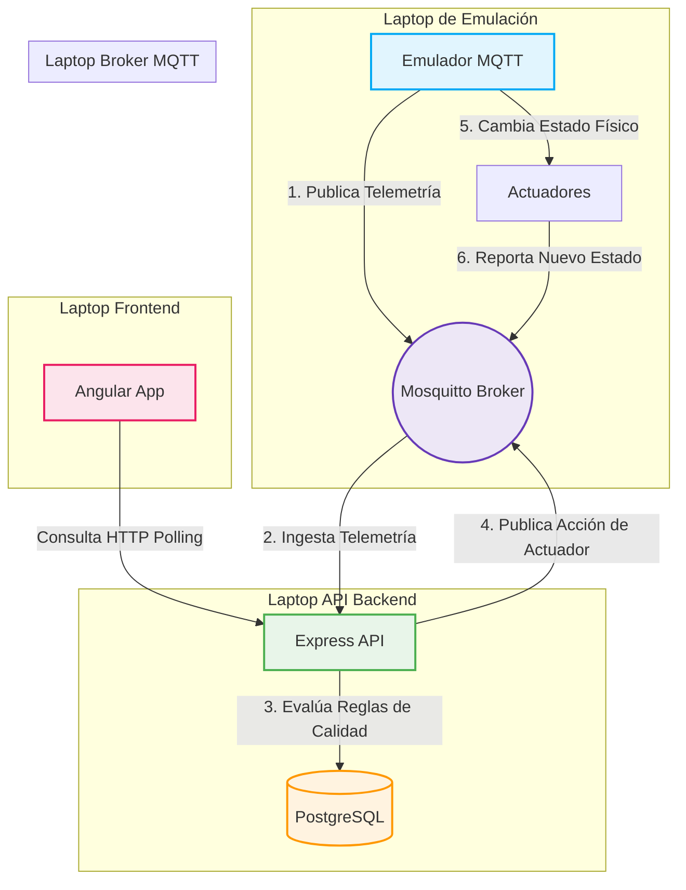

# 🌬️ SafeAir: Sistema de Monitoreo de Calidad de Aire y Climatización

SafeAir es una plataforma de IoT de última generación y de nivel empresarial diseñada para la telemetría, el monitoreo y el control inteligente de la calidad del aire y la climatización en salas cerradas. Su arquitectura desacoplada y orientada a eventos permite procesar mediciones ambientales críticas en tiempo real y coordinar acciones automáticas sobre actuadores físicos para mantener entornos saludables.

Este repositorio está estructurado en dos servicios principales:
*   **`Api_Emuladores` (Backend)**: API robusta desarrollada con Node.js, Express, Sequelize ORM (PostgreSQL) y comunicación en tiempo real vía MQTT.
*   **`Frontend_SafeAir` (Frontend)**: Interfaz de usuario moderna y responsiva construida con Angular 19.

---

## 🏗️ Diagrama de Arquitectura de Red

La comunicación del sistema forma un lazo cerrado de control (Control Loop) continuo y ultra-eficiente:



---

## 💻 Escenario 1: Ejecución Monolítica Local (1 Sola Máquina)

Este escenario es ideal para desarrollo rápido, depuración y pruebas locales del flujo de datos en un único computador.

### 📋 Prerrequisitos
*   **Node.js**: Versión 18 o superior.
*   **Docker Desktop**: Instalado y corriendo (para servicios auxiliares de base de datos y broker MQTT).

---

### Paso 1: Levantar Infraestructura Auxiliar (Base de Datos y MQTT)

Para evitar conflictos de puertos y asegurar que los servicios de aplicación corran de forma nativa en tu máquina, levantaremos **únicamente** la base de datos PostgreSQL y el broker Mosquitto MQTT usando Docker Compose:

```bash
# Asegúrate de detener cualquier contenedor previo que genere conflicto
docker stop safeair-frontend safeair-api safeair-db safeair-mqtt 2>/dev/null || true

# Levantar únicamente los servicios de base de datos y MQTT
docker compose up -d db mqtt
```

> [!TIP]
> La base de datos PostgreSQL estará accesible localmente en el puerto `6543` y el broker MQTT en el puerto `1883`.

---

### Paso 2: Inicializar y Configurar el Backend API

1. Accede al directorio del backend e instala las dependencias:
    ```bash
    cd Api_Emuladores
    npm install
    ```
2. Crea tu archivo de configuración de entorno:
    ```bash
    cp .env.example .env
    ```
3. Ejecuta el script de semilla para crear la base de datos, las tablas y poblar los datos iniciales del administrador y de la sala de demostración:
    ```bash
    npm run seed
    ```
4. Inicia el servidor de desarrollo nativo:
    ```bash
    npm run dev
    ```

El servidor estará escuchando en `http://localhost:3000`. Puedes verificar su estado en `http://localhost:3000/health`.

---

### Paso 3: Iniciar el Emulador MQTT Interactivo Nactivo

Hemos desarrollado un **emulador interactivo en consola** que simula cambios ambientales realistas y responde a comandos automáticos del backend.

En una nueva terminal, accede a la carpeta del backend y ejecuta:
```bash
cd Api_Emuladores
npm run emulator
```

El emulador iniciará inmediatamente:
1. Se autenticará automáticamente en la API local.
2. Obtendrá dinámicamente la configuración y ID de la sala (`Room A`).
3. Se conectará al Broker MQTT local.
4. Comenzará a publicar telemetría de sensores cada 5 segundos y responderá a acciones de climatización.

---

### Paso 4: Inicializar y Configurar el Frontend

1. En una nueva terminal, navega al directorio del frontend e instala las dependencias:
    ```bash
    cd Frontend_SafeAir
    npm install
    ```
2. Inicia la aplicación en el servidor local de Angular:
    ```bash
    npm start
    ```

Abre tu navegador en `http://localhost:4200` para interactuar con la interfaz gráfica. 
*   **Credenciales de acceso predeterminadas:**
    *   **Usuario:** `admin@safeair.local`
    *   **Contraseña:** `admin123`

---

## 🌐 Escenario 2: Ejecución Distribuida en Red (Multi-Laptop)

Este escenario simula un entorno productivo real donde la infraestructura está distribuida a través de la red local física mediante múltiples dispositivos independientes (laptops).

### 🎛️ Distribución de Roles por Laptop

| Laptop | Componente | Software Requerido | Configuración Clave |
| :--- | :--- | :--- | :--- |
| **Laptop A** | Base de Datos (PostgreSQL) | Docker o Postgres Nativo | Habilitar acceso externo en `pg_hba.conf` y `listen_addresses = '*'` |
| **Laptop B** | API Backend | Node.js 18+ | `BACKEND_BIND_HOST=0.0.0.0`, `DB_HOST=IP_LAPTOP_A` |
| **Laptop C** | Emuladores MQTT | Node.js 18+ | `BACKEND_API_URL=http://IP_LAPTOP_B:3000`, `MQTT_URL=mqtt://IP_LAPTOP_C:1883` |
| **Laptop D** | Frontend Angular | Node.js 18+ | `API_BASE_URL: 'http://IP_LAPTOP_B:3000'` en `environment.ts` |

---

### 1. Configuración de Laptop A (Base de Datos)
1. Levanta la base de datos mapeando el puerto `6543`:
   ```bash
   docker run -d --name safeair-db -p 6543:5432 -e POSTGRES_DB=safeair -e POSTGRES_USER=postgres -e POSTGRES_PASSWORD=postgres postgres:16
   ```
2. Asegúrate de que el firewall permita conexiones entrantes en el puerto `6543`.

### 2. Configuración de Laptop B (API Backend)
1. Edita el archivo `.env` para apuntar a la IP de la Laptop A:
   ```env
   DB_HOST=IP_DE_LAPTOP_A  # Ejemplo: 192.168.1.50
   DB_PORT=6543
   BACKEND_BIND_HOST=0.0.0.0
   BACKEND_PORT=3000
   MQTT_URL=mqtt://IP_DE_LAPTOP_C:1883 # Broker en Laptop C
   ```
2. Ejecuta el backend con `npm run dev`. Ahora la API aceptará peticiones entrantes en el puerto `3000` de cualquier laptop de la red.

### 3. Configuración de Laptop C (Broker y Emuladores MQTT)
1. Levanta el Broker Mosquitto MQTT en esta laptop:
   ```bash
   docker run -d --name safeair-mqtt -p 1883:1883 eclipse-mosquitto:2
   ```
2. Abre una terminal y configura las variables para ejecutar el emulador de SafeAir:
   ```env
   export BACKEND_API_URL=http://IP_DE_LAPTOP_B:3000  # Ejemplo: 192.168.1.51:3000
   export MQTT_URL=mqtt://localhost:1883
   ```
3. Ejecuta el comando:
   ```bash
   npm run emulator
   ```

### 4. Configuración de Laptop D (Frontend Angular)
1. Abre `Frontend_SafeAir/src/environments/environment.ts`.
2. Modifica la variable `API_BASE_URL` para que apunte a la IP de la Laptop B (Backend):
   ```typescript
   API_BASE_URL: 'http://IP_DE_LAPTOP_B:3000', // Ejemplo: http://192.168.1.51:3000
   ```
3. Ejecuta la aplicación de frontend para que sea accesible desde la red local:
   ```bash
   npm start -- --host 0.0.0.0 --disable-host-check
   ```

Cualquier laptop de la red ahora podrá ingresar a `http://IP_DE_LAPTOP_D:4200` y ver el flujo en vivo del sistema.

---

## 🛠️ Resolución de Problemas (Troubleshooting)

> [!WARNING]
> **El puerto 4200 ya está en uso**  
> Si recibes este error al iniciar el frontend, se debe a que tienes corriendo otro frontend de Angular (como `empleados-frontend` o contenedores de Docker previos). Detén el servicio que genera conflicto con:  
> `docker stop empleados-frontend safeair-frontend 2>/dev/null || true`

> [!IMPORTANT]
> **Error de Conexión de Base de Datos (Connection Refused)**  
> Asegúrate de que el contenedor de la base de datos está arriba ejecutando `docker ps`. Si estás en red, verifica que la laptop del backend pueda comunicarse con la laptop de la base de datos ejecutando `ping IP_DE_LAPTOP_A` y que el firewall no esté bloqueando el puerto `6543`.

> [!TIP]
> **¿Cómo reiniciar los datos por completo?**  
> Puedes limpiar la base de datos y volver a sembrar los datos originales en cualquier momento deteniendo la API y ejecutando `npm run seed` en el backend.

---

## 🧪 Comandos de Pruebas y Validación

*   **Verificar API en línea:** `curl http://localhost:3000/health`
*   **Validación de tipos de TypeScript:** `npm run typecheck` (Ejecutar en la carpeta `Api_Emuladores`)
*   **Pruebas unitarias de Frontend:** `npm test` (Ejecutar en la carpeta `Frontend_SafeAir`)