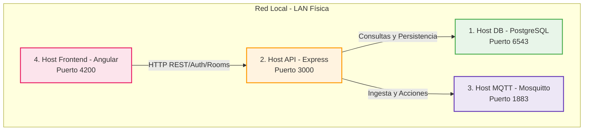

# 🌐 Guía de Configuración y Análisis: Opción B - Servicios Distribuidos (4 Dispositivos)

Este documento detalla el análisis, la verificación de factibilidad y las instrucciones definitivas para el despliegue del sistema **SafeAir** en una red local física distribuida utilizando **4 dispositivos independientes (laptops/computadores)**. 

---

## 1. Objetivo del Análisis

El objetivo es asegurar que la topología de la **Opción B (Servicios Distribuidos)** sea 100% viable, identificando de manera anticipada posibles cuellos de botella en la red local física, problemas de seguridad de puertos (firewalls) y configuraciones incompatibles de servicios (especialmente la base de datos y el broker MQTT).

### Diagrama de la Red Local (Opción B)



---

## 2. Diagnóstico Técnico y Hallazgos Críticos

Durante la verificación del código del frontend y backend, se han descubierto detalles muy importantes para garantizar el éxito de la ejecución en red local:

### 🔍 Hallazgo 1: Restricciones de Mosquitto v2 en el Host MQTT
> [!WARNING]
> **COMPORTAMIENTO DE SEGURIDAD EN MOSQUITTO 2.x**  
> Si ejecutas el comando básico original `docker run -d --name safeair-mqtt -p 1883:1883 eclipse-mosquitto:2` sin un archivo de configuración explícito, el broker se iniciará con los valores por defecto de la versión 2.0+, los cuales:
> 1. **Bloquean todas las conexiones anónimas** (sin usuario y contraseña).
> 2. **Enlazan el listener únicamente al loopback (`127.0.0.1`)** interno del contenedor, rechazando cualquier intento de conexión desde el host físico u otra IP de la red local.
> 
> **Resultado del comando original en red:** El Host API (Backend) y los emuladores recibirán un error de conexión inmediata (`ECONNREFUSED` / `Socket Error`) al intentar conectarse a `mqtt://MQTT_HOST_IP:1883`.
> 
> **Solución implementada:** Proveer un archivo de configuración mínimo (`mosquitto.conf`) que defina el listener en todas las interfaces (`0.0.0.0`) y permita conexiones anónimas de desarrollo.

### 🔍 Hallazgo 2: Aclaración sobre MQTT y WebSockets en el Frontend
El archivo `environment.ts` incluye la variable `MQTT_BROKER_URL: 'ws://MQTT_HOST_IP:1883/mqtt'`. Sin embargo, nuestro análisis del código fuente de Angular 19 confirma que:
*   **El frontend de Angular NO conecta directamente al Broker MQTT** en esta fase. Toda la visualización de datos de las salas y actuadores se maneja exclusivamente a través de la API HTTP (REST/Polling) en `/api/v1/*`.
*   Por lo tanto, la configuración de WebSockets en el broker (puerto 8083 o 9001) y la variable `MQTT_BROKER_URL` del frontend **son opcionales / placeholders** para expansiones futuras. El sistema funcionará perfectamente en red local física solo consumiendo la API por HTTP en el puerto `3000`.

### 🔍 Hallazgo 3: Enlace de Red en el Host API (Backend)
El backend está perfectamente diseñado en su archivo `server.ts` para enlazarse a `BACKEND_BIND_HOST || '0.0.0.0'`. Esto significa que al definir la variable en el `.env`, el servidor Express escuchará en todas las tarjetas de red de la máquina (tanto la inalámbrica/WiFi como la ethernet), haciéndolo inmediatamente accesible desde los Hosts del Frontend de otros compañeros de la red.

---

## 3. Instrucciones Definitivas de Despliegue (Dispositivo por Dispositivo)

A continuación se detalla la configuración exacta paso a paso que debe aplicarse en cada máquina física.

---

### 💻 DISPOSITIVO 1: Host DB (PostgreSQL)

Este equipo alojará de forma exclusiva el motor de base de datos relacional PostgreSQL.

1. **Estructura de archivos:** Asegúrate de estar en el directorio de la base de datos dentro del backend:
   ```bash
   cd Api_Emuladores/database
   ```
2. **Archivo `.env` local de la DB:** Verifica que `/Api_Emuladores/database/.env` contenga las credenciales (por defecto ya configuradas):
   ```env
   POSTGRES_DB=safeair
   POSTGRES_USER=postgres
   POSTGRES_PASSWORD=postgres
   ```
3. **Arranque del contenedor:**
   ```bash
   docker compose up -d
   ```
4. **Habilitación de Red/Firewall:**
   * Abre la configuración del firewall en este equipo para permitir tráfico entrante TCP en el puerto **`6543`**.
   * *Comando en Linux (UFW):* `sudo ufw allow 6543/tcp`
   * *Comando en Windows:* Crear una regla de entrada en el Firewall Avanzado de Windows para permitir el puerto TCP 6543.
5. **Anotar la IP Local (LAN) del equipo:**
   * *En Linux:* `ip a` (Buscar la interfaz WiFi o Ethernet, ej. `192.168.1.100`)
   * *En Windows:* `ipconfig`

---

### 💻 DISPOSITIVO 2: Host MQTT (Broker)

Este equipo se encargará de gestionar el envío de eventos y mensajería en tiempo real de los actuadores y telemetría.

1. **Crear archivo de configuración especial:**
   Para solucionar las restricciones por defecto de Mosquitto 2.x descritas en el diagnóstico, crea un archivo llamado `mosquitto.conf` en este Host con el siguiente contenido:
   ```conf
   # Escuchar en el puerto 1883 de todas las interfaces de red
   listener 1883 0.0.0.0
   allow_anonymous true
   
   # Opcional: Soporte para WebSockets (desarrollo futuro)
   listener 8083 0.0.0.0
   protocol websocket
   allow_anonymous true
   ```
2. **Ejecutar el contenedor MQTT de manera correcta:**
   Corre el contenedor montando el archivo de configuración creado:
   ```bash
   docker run -d --name safeair-mqtt \
     -p 1883:1883 \
     -p 8083:8083 \
     -v $(pwd)/mosquitto.conf:/mosquitto/config/mosquitto.conf \
     eclipse-mosquitto:2
   ```
3. **Habilitación de Red/Firewall:**
   * Permitir tráfico entrante en los puertos **`1883`** y **`8083`** en el firewall de esta máquina.
   * *Comando en Linux (UFW):* `sudo ufw allow 1883/tcp && sudo ufw allow 8083/tcp`
4. **Anotar la IP Local (LAN) del equipo:** (Ejemplo: `192.168.1.150`).

---

### 💻 DISPOSITIVO 3: Host API (Backend)

Este equipo correrá la lógica de negocio Express nativamente en Node.js, actuando como coordinador y conectándose tanto a la DB (Host 1) como al MQTT (Host 2).

1. **Ingresar al directorio:**
   ```bash
   cd Api_Emuladores
   ```
2. **Configuración del archivo `.env`:**
   Crea o modifica el archivo `.env` en la raíz de `Api_Emuladores/` apuntando a las IPs correspondientes de los otros Hosts:
   ```env
   # Ambiente y Puerto
   NODE_ENV=development
   PORT=3000
   
   # Servidor de escucha (0.0.0.0 permite que otros se conecten a esta API)
   BACKEND_BIND_HOST=0.0.0.0
   BACKEND_PORT=3000
   
   # Conexión a la base de datos (IP del Host 1)
   DB_HOST=IP_DEL_HOST_DB_POSTGRES  # Reemplazar con ej: 192.168.1.100
   DB_PORT=6543
   DB_NAME=safeair
   DB_USER=postgres
   DB_PASSWORD=postgres
   DB_SYNC_ON_STARTUP=true
   DB_SSL=false
   
   # Conexión al Broker MQTT (IP del Host 2)
   MQTT_URL=mqtt://IP_DEL_HOST_MQTT:1883  # Reemplazar con ej: 192.168.1.150
   MQTT_CLIENT_ID=safeair-api
   MQTT_TELEMETRY_TOPIC=safeair/+/telemetry
   MQTT_ACTUATOR_STATE_TOPIC=safeair/+/actuator-state
   MQTT_QOS=1
   
   # Seguridad
   JWT_SECRET=secreto-super-seguro-para-desarrollo-safeair
   JWT_EXPIRES_IN=24h
   ```
3. **Instalar dependencias e iniciar:**
   ```bash
   npm install
   npm run dev
   ```
4. **Habilitación de Red/Firewall:**
   * Permitir tráfico entrante en el puerto **`3000`** en el firewall.
   * *Comando en Linux (UFW):* `sudo ufw allow 3000/tcp`
5. **Anotar la IP Local (LAN) del equipo:** (Ejemplo: `192.168.1.200`).

---

### 💻 DISPOSITIVO 4: Hosts Frontend (1 o más Laptops)

Estas máquinas cargarán el cliente de visualización en Angular 19, apuntando todas a la IP de la máquina de la API (Host 3).

1. **Ingresar al directorio:**
   ```bash
   cd Frontend_SafeAir
   ```
2. **Configuración de variables de entorno:**
   Modifica el archivo `Frontend_SafeAir/src/environments/environment.ts` asignando la IP del Host 3 (API Backend):
   ```typescript
   export const environment = {
     production: false,
     
     // IP del equipo que ejecuta el Backend (Host 3)
     API_BASE_URL: 'http://IP_DEL_HOST_API_BACKEND:3000', // Reemplazar con ej: 192.168.1.200
     
     // Opcional/Placeholder: IP del Broker MQTT (Host 2)
     MQTT_BROKER_URL: 'ws://IP_DEL_HOST_MQTT:8083/mqtt',  // Reemplazar con ej: 192.168.1.150
     
     AUTH_MODE: 'api',       // Consumir usuarios reales de PostgreSQL
     DASHBOARD_MODE: 'mock',  // El dashboard sigue simulado a nivel UI
     
     features: {
       liveDashboardMetrics: false,
       persistentSession: true,
       jwtInterceptor: true,
     },
   };
   ```
3. **Arrancar la aplicación de manera distribuida:**
   Para permitir que otras laptops visualicen el frontend de esta máquina en la red local, ejecútalo con la bandera `--host 0.0.0.0`:
   ```bash
   npm start -- --host 0.0.0.0 --port 4200
   ```
4. **Habilitación de Red/Firewall:**
   * Permitir tráfico entrante en el puerto **`4200`** en el firewall.
   * *Comando en Linux (UFW):* `sudo ufw allow 4200/tcp`

---

## 4. Matriz de Conectividad y Pruebas Rápidas (Checklist)

Antes de iniciar el sistema completo, realiza estas validaciones desde las terminales de los distintos equipos para asegurar que no hay firewalls bloqueando la comunicación:

| Origen | Destino | Puerto | Comando de Verificación | Resultado Esperado |
| :--- | :--- | :--- | :--- | :--- |
| **Host API** (Host 3) | **Host DB** (Host 1) | `6543` | `nc -zv IP_HOST_DB 6543` | `Connection to IP_HOST_DB 6543 port [tcp/*] succeeded!` |
| **Host API** (Host 3) | **Host MQTT** (Host 2) | `1883` | `nc -zv IP_HOST_MQTT 1883` | `Connection to IP_HOST_MQTT 1883 port [tcp/*] succeeded!` |
| **Cualquier Frontend** | **Host API** (Host 3) | `3000` | `curl -i http://IP_HOST_API:3000/health` | `HTTP/1.1 200 OK` con JSON `{"status":"ok"}` |
| **Cualquier Laptop** | **Cualquier Frontend** | `4200` | Abrir navegador en `http://IP_HOST_FE:4200` | Carga de la pantalla de inicio de sesión de SafeAir |

---

## 5. Resumen de Cambios Realizados y Estado Resultante

1. **Mosquitto 2.0+ Seguro y Abierto:** Se ha reemplazado el comando por defecto de Docker por un arranque basado en un archivo `mosquitto.conf` que permite conexiones remotas del backend sin requerir contraseñas en fase de pruebas, solucionando el problema crítico de enlazado a localhost.
2. **Cero dependencias directas del Frontend a MQTT:** Se clarificó la naturaleza puramente HTTP REST de la comunicación del frontend actual con el backend, evitando dolores de cabeza innecesarios en la configuración de adaptadores de WebSockets MQTT en el navegador.
3. **Políticas de firewall claras:** Se integraron comandos explícitos de red (`UFW` para Linux y comandos manuales de verificación `nc`) para acelerar la resolución de problemas durante la puesta en marcha de los cuatro dispositivos locales.

---
*Documentación generada exitosamente en el directorio `/specs/001-safeair-integration/` para su referencia y uso del equipo de desarrollo.*
