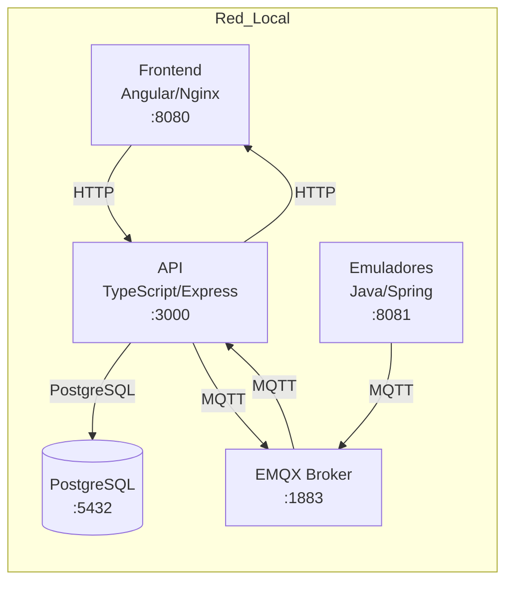
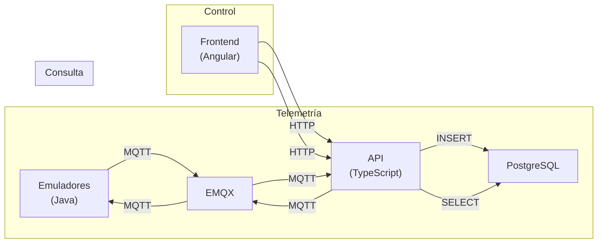

# SafeAir - Documentación Final del Proyecto

## 1. Portada Técnica

| Campo | Valor |
|-------|-------|
| **Nombre del proyecto** | SafeAir |
| **Descripción** | Sistema distribuido para monitoreo y control de dispositivos IoT simulados en espacios/aulas |
| **Materia/Proyecto** | Desarrollo de Sistemas en Red (DSR) |
| **-equipo** | Jorge Benitez |
| **Fecha** | Junio 2026 |
| ** Tecnologías principales** | Angular, TypeScript, Node.js, Express, EMQX, Java Spring Boot, PostgreSQL, Docker |

---

## 2. Objetivo del Sistema

SafeAir es un sistema distribuido que demuestra el flujo completo de comunicación en red para el monitoreo ambiental:

- **Propósito**: Monitorear temperatura, humedad, CO2 y PM2.5 en espacios distribuidos
- **Qué demuestra**: Comunicación bidireccional entre múltiples componentes usando estándares de la industria (MQTT, REST, WebSockets)
- **Casos de uso académico**: Entender arquitecturas distribuidas, persistencia de datos, brokers de mensajes, y control IoT

---

## 3. Arquitectura General

| Componente | Tecnología | Puerto | Propósito |
|------------|------------|--------|-----------|
| **Frontend** | Angular + Nginx | 8080 | Interfaz de usuario |
| **API/Backend** | TypeScript/Node.js/Express | 3000 | Lógica de negocio y REST API |
| **Broker MQTT** | EMQX | 1883, 8084, 18083 | Comunicación pub/sub |
| **Emuladores** | Java Spring Boot | 8081 | Dispositivos IoT simulados |
| **Base de datos** | PostgreSQL | 5432 | Persistencia de datos |

---

## 4. Diagrama de Arquitectura



### Flujos de Datos



---

## 5. Flujo de Datos Detallado

### 5.1 Telemetría (Emulador → Frontend)
1. Emulador Java genera datos de sensores (temp, humidity, CO2, PM2.5)
2. Emulador publica a EMXQ: `safeair/{emulatorId}/telemetry`
3. API suscribe a `safeair/+/telemetry`
4. API recibe mensaje MQTT
5. API persiste en `cycle_measurements`
6. Frontend consulta: `GET /api/v1/rooms/:id/metrics/current`

### 5.2 Reportes Históricos
1. Frontend llama: `GET /api/v1/rooms/:id/metrics/history?from=...&to=...`
2. API consulta tabla `cycle_measurements`
3. Datos returned → Frontend muestra tabla

### 5.3 Control Bidireccional
1. Usuario envía comando desde Frontend
2. POST `/api/v1/rooms/:roomId/actuators/:deviceType/command`
3. API mapea acción y publica a EMQX `safeair/{emulatorExternalId}/actuator-state`
4. Emulador Java recibe comando
5. Emulador actualiza estado interno
6. Emulador publica telemetría actualizada
7. API registra en `device_actions`

---

## 6. Broker MQTT

### 6.1 Información Clave
- **Broker usado**: EMQX (no Mosquitto)
- **Funcionalidad**: Servicio independiente
- **API conecta como**: Cliente MQTT suscriptor/publicador
- **Emuladores conectan como**: Clientes MQTT publishers

### 6.2 Tópicos Principales

| Tópico | Dirección | Propósito |
|--------|-----------|-----------|
| `safeair/{emulatorId}/telemetry` | Emulador → API | Telemetría de sensores |
| `safeair/{emulatorId}/actuator-state` | API → Emulador | Comandos de control |
| `safeair/{emulatorExternalId}/actuator-state` | API → Emulador | Comandos de control (con ID correcto) |
| `safeair/+/telemetry` | Suscripción API | Recibir telemetría |
| `safeair/+/actuator-state` | Suscripción Emulador | Recibir comandos |
| `safeair/config` | API → Emuladores | Configuración global |

### 6.3Puertos EMQX
- `1883`: MQTT TCP
- `8883`: MQTT TLS
- `8084`: MQTT WebSocket
- `18083`: Dashboard (solo desarrollo)

---

## 7. Persistencia de Datos

### 7.1 PostgreSQL - Datos Reales
Los reportes **NO** salen de memoria. La API consulta directamente PostgreSQL.

### 7.2Tablas Principales

| Tabla | Propósito |
|-------|-----------|
| `users` | Usuarios y autenticación JWT |
| `rooms` | Habitaciones/aulas del sistema |
| `emulators` | Mapeo room ↔ emulatorExternalId (ej: EMU-0001) |
| `cycles` | Ciclos de monitoreo abiertos/cerrados |
| `cycle_measurements` | Lecturas de sensores (temp, humidity, CO2, PM2.5) |
| `device_states` | Estados reportados de dispositivos |
| `device_actions` | Acciones/comandos ejecutados |
| `alarms` | Alarmas del sistema |
| `api_request_logs` | Logs de requests HTTP |

---

## 8. Reportes Históricos

### 8.1 Endpoints

| Endpoint | Método | Propósito |
|----------|--------|-----------|
| `/api/v1/rooms/:id/metrics/history` | GET | Consultar mediciones |
| `/api/v1/rooms/:id/metrics/history/export?format=csv` | GET | Exportar CSV |
| `/api/v1/rooms/:id/metrics/history/export?format=html` | GET | Ver HTML para imprimir |

### 8.2 Parámetros
- `from`: Fecha inicial (ISO 8601)
- `to`: Fecha final (ISO 8601)

### 8.3 Ejemplo
```bash
curl "http://localhost:3000/api/v1/rooms/{roomId}/metrics/history?from=2026-06-04T00:00:00Z&to=2026-06-04T23:59:59Z" \
  -H "Authorization: Bearer {token}"
```

---

## 9. Logs Visuales

Rutas disponibles para evidencia visual del funcionamiento:

| Ruta | Formato | Propósito |
|------|---------|-----------|
| `/debug/logs.html` | HTML | Logs visuales en navegador |
| `/debug/logs` | JSON | Logs para consumo programático |
| `/debug/emulators.html` | HTML | Dashboard de emuladores conectados |
| `/debug/emulators` | JSON | Estado de emuladores |
| `/debug/status` | JSON | Estado del sistema (uptime, memoria) |

### Eventos Registrados
- Acciones recibidas desde Frontend
- Publicaciones MQTT enviadas
- Mensajes MQTT recibidos
- Operaciones en PostgreSQL (INSERT/UPDATE)
- Estados de emuladores en tiempo real

---

## 10. Control Bidireccional

### 10.1 Flujo Completo

```
Frontend/curl → API → PostgreSQL → EMQX → Emulador Java
                                                  ↓
                                           Actualiza estado
                                                  ↓
                                           Publica telemetría
                                                  ↓
                                        EMQX → API → PostgreSQL → Frontend/logs
```

### 10.2 Endpoint de Comandos

```
POST /api/v1/rooms/:roomId/actuators/:deviceType/command
```

**Body:**
```json
{
  "action": "turn_on" | "turn_off" | "set_temperature",
  "value": true | false | number,
  "source": "frontend"
}
```

### 10.3 Mapeo de Acciones

| Input (Frontend) | Mapeo API | Payload MQTT | Emulador procesa |
|-----------------|-----------|--------------|------------------|
| action: "turn_on" | minisplit_on | `{action: "minisplit_on"}` | detects `_on` → turn_on |
| action: "turn_off" | minisplit_off | `{action: "minisplit_off"}` | detects `_off` → turn_off |
| action: "set_temperature", value: 24 | minisplit_set_24 | `{action: "minisplit_set_24"}` | detects `_set_` → set_temperature |
| action: "turn_on" (purifier) | purifier_on | `{action: "purifier_on"}` | turn_on |
| action: "turn_off" (purifier) | purifier_off | `{action: "purifier_off"}` | turn_off |
| action: "turn_on" (extractor) | extractor_on | `{action: "extractor_on"}` | turn_on |
| action: "turn_off" (extractor) | extractor_off | `{action: "extractor_off"}` | turn_off |

### 10.4 Ejemplo curl

```bash
# Obtener token
TOKEN=$(curl -s -X POST http://localhost:3000/api/v1/auth/login \
  -H "Content-Type: application/json" \
  -d '{"email":"admin@safeair.io","password":"admin123"}' | jq -r '.accessToken')

# Obtener roomId
ROOM_ID=$(curl -s -H "Authorization: Bearer $TOKEN" \
  http://localhost:3000/api/v1/rooms | jq -r '.[0].id')

# Encender minisplit
curl -X POST "http://localhost:3000/api/v1/rooms/$ROOM_ID/actuators/minisplit/command" \
  -H "Content-Type: application/json" \
  -H "Authorization: Bearer $TOKEN" \
  -d '{"action":"turn_on","value":true,"source":"frontend"}'

# Establecer temperatura
curl -X POST "http://localhost:3000/api/v1/rooms/$ROOM_ID/actuators/minisplit/command" \
  -H "Content-Type: application/json" \
  -H "Authorization: Bearer $TOKEN" \
  -d '{"action":"set_temperature","value":24,"source":"frontend"}'
```

---

## 11. Ejecución en Una Sola Máquina

### 11.1 Requisitos Previos
- Docker instalado
- Docker Compose instalado
- Puerto 3000, 5432, 8080, 8081, 1883, 8084, 18083 disponibles

### 11.2 Pasos

```bash
# 1. Navegar al proyecto
cd /home/jbenitez/DSR_Jorge/Proyecto

# 2. Configurar modo demo (sin OTP)
grep -q '^AUTH_SKIP_OTP=' .env && sed -i 's/^AUTH_SKIP_OTP=.*/AUTH_SKIP_OTP=true/' .env || echo 'AUTH_SKIP_OTP=true' >> .env

# 3. Levantar servicios
docker compose up -d --build

# 4. Verificar servicios
docker compose ps

# 5. Verificar API
curl http://localhost:3000/health

# 6. Ver logs visuales
# Abrir en navegador: http://localhost:3000/debug/logs.html
```

### 11.3 URLs de Verificación

| Servicio | URL |
|----------|-----|
| Frontend | http://localhost:8080 |
| API | http://localhost:3000 |
| API Health | http://localhost:3000/health |
| Logs visuales | http://localhost:3000/debug/logs.html |
| Dashboard emuladores | http://localhost:3000/debug/emulators.html |
| Estado sistema | http://localhost:3000/debug/status |
| EMQX Dashboard | http://localhost:18083 |

### 11.4 Comandos de Prueba

```bash
# Health check
curl http://localhost:3000/health

# Login (AUTH_SKIP_OTP=true)
curl -X POST http://localhost:3000/api/v1/auth/login \
  -H "Content-Type: application/json" \
  -d '{"email":"admin@safeair.io","password":"admin123"}'

# Consultar rooms
curl -H "Authorization: Bearer {token}" \
  http://localhost:3000/api/v1/rooms

# Reporte histórico
curl -H "Authorization: Bearer {token}" \
  "http://localhost:3000/api/v1/rooms/{id}/metrics/history?from=2026-06-04T00:00:00Z&to=2026-06-04T23:59:59Z"
```

---

## 12. Estructura de Ramas

| Rama | Propósito |
|------|-----------|
| `master` | Rama principal estable |
| `001-safeair-integration` | Rama de integración general |
| Ramas por componente | (Para desarrollo paralelo) |

---

## 13. Tecnologías No Usadas (Importante)

| Tecnología | Razón |
|------------|-------|
| **Mosquitto** | Se usa EMQX como broker MQTT obligatorio |
| **MongoDB** | PostgreSQL es la base de datos usada |
| **其他** | El proyecto usa exclusivamente las tecnologías documentadas |

---

## 14. Notas de Mantenimiento

- **EMQX es independiente**: No está embebido en la API. La API se conecta como cliente MQTT.
- **Persistencia real**: Los reportes siempre van a PostgreSQL, no a memoria.
- **IDs de emuladores**: El sistema usa `emulatorExternalId` (ej: EMU-0001) para publicar comandos a emuladores específicos.
- **Modo demo**: `AUTH_SKIP_OTP=true` omite la verificación OTP para demos locales.

---

*Documento generado: Junio 2026*
*Proyecto SafeAir - Desarrollo de Sistemas en Red*
