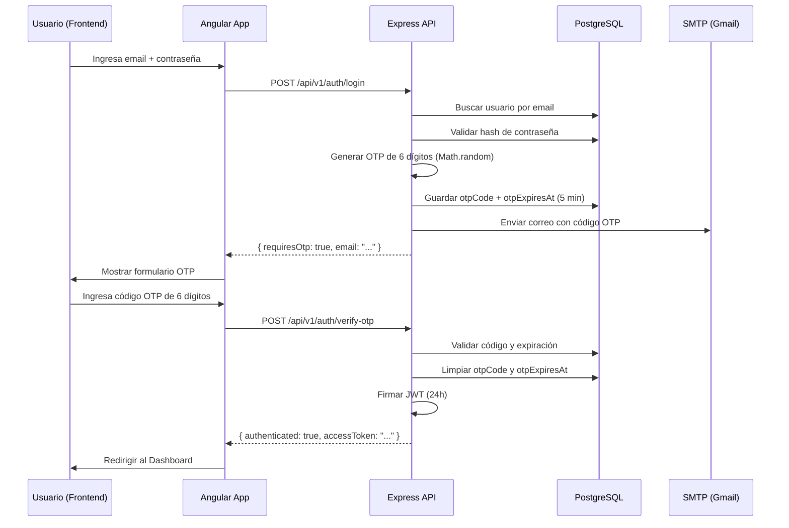

# Especificación Técnica: Autenticación 2FA/OTP — SafeAir

> **Fecha:** 2 de junio de 2026  
> **Rama:** `001-safeair-integration`  
> **Autor:** Antigravity AI + JeshuaBenitez

---

## 1. Descripción General

SafeAir implementa un sistema de **Autenticación de Dos Factores (2FA)** basado en **códigos OTP (One-Time Password) de 6 dígitos** enviados por correo electrónico. Este mecanismo protege el acceso al sistema exigiendo una verificación adicional después de validar las credenciales del usuario.

### Flujo de Autenticación



---

## 2. Endpoints del Backend

| Método | Ruta | Descripción |
|--------|------|-------------|
| `POST` | `/api/v1/auth/login` | Valida credenciales, genera OTP y lo envía por correo. Retorna `{ requiresOtp: true, email }` |
| `POST` | `/api/v1/auth/verify-otp` | Valida el código OTP. Si es correcto, retorna JWT + datos de sesión |
| `POST` | `/api/v1/auth/resend-otp` | Genera un nuevo OTP y lo reenvía al correo del usuario |
| `POST` | `/api/v1/auth/register` | Crea una nueva cuenta de usuario (rol `operator`) |
| `GET`  | `/api/v1/auth/me` | Retorna datos del usuario autenticado (requiere JWT) |

### Schemas de Validación (Zod)

- **login**: `{ email?: string, identifier?: string, password: string }` — acepta `identifier` por retrocompatibilidad.
- **verify-otp**: `{ email: string, code: string(6) }`
- **resend-otp**: `{ email: string }`
- **register**: `{ firstName, lastName, email, password, confirmPassword }`

---

## 3. Modelo de Datos

### Tabla `users`

| Campo | Tipo | Descripción |
|-------|------|-------------|
| `id` | `UUID` | Clave primaria auto-generada |
| `email` | `STRING(120)` | Correo único del usuario |
| `passwordHash` | `STRING(255)` | Hash bcrypt de la contraseña |
| `fullName` | `STRING(120)` | Nombre completo |
| `role` | `ENUM('admin','operator')` | Rol del usuario |
| `otpCode` | `STRING(6) NULL` | Código OTP activo (se limpia tras verificación) |
| `otpExpiresAt` | `DATE NULL` | Fecha de expiración del código OTP |

> La sincronización de columnas `otpCode` y `otpExpiresAt` se realiza automáticamente con `sequelize.sync({ alter: true })` en el archivo `sync.ts`.

---

## 4. Servicio de Correo Electrónico (`EmailService`)

### Estrategia de Envío (3 niveles)

```
1. SMTP real configurado (SMTP_HOST no vacío)
   → Usa nodemailer con las credenciales del proveedor (Gmail, Brevo, etc.)

2. Ethereal Mail fallback (SMTP_HOST vacío, con internet)
   → Genera cuenta temporal y loguea URL de vista previa en consola
   → Timeout de 10 segundos para evitar bloqueos en Docker

3. Fallback de consola (sin SMTP, sin Ethereal)
   → Imprime el código OTP directamente en los logs del backend
   → Formato: [OTP-FALLBACK] Código: XXXXXX
   → Permite que Docker local funcione sin SMTP ni Ethereal
```

### Template de Correo

El correo se envía en HTML con diseño premium en modo oscuro, consistente con la identidad visual de SafeAir:
- Header con logo y subtítulo de marca
- Código OTP resaltado con tipografía monoespaciada
- Advertencia de expiración (5 minutos)
- Footer corporativo

---

## 5. Componente Frontend (`sa-otp-form`)

### Características de UX

- **6 campos individuales** de entrada numérica con auto-enfoque progresivo.
- **Auto-submit**: cuando los 6 dígitos se completan, se envía automáticamente.
- **Soporte de pegado**: detecta un código de 6 dígitos pegado del portapapeles y lo distribuye en los campos.
- **Retroceso inteligente**: la tecla `Backspace` borra el campo actual y enfoca el anterior.
- **Temporizador de expiración**: cuenta regresiva visual de 5 minutos.
- **Cooldown de reenvío**: bloquea el botón "Reenviar código" por 60 segundos.
- **Feedback visual**: mensajes de error animados con shake, mensajes de éxito en verde.
- **Modo expirado**: los campos se atenúan y muestran borde rojo cuando el código expira.

### Dimensiones de los Campos (corregidas)

- Ancho: `48px` (fijo)
- Altura: `48px`
- Font-size: `1.35rem`
- Gap entre campos: `8px`
- Alineación: centrados horizontalmente

---

## 6. Configuración SMTP por Entorno

### 6a. Docker Local (`docker-compose.yml` + `.env.docker`)

| Variable | Valor |
|----------|-------|
| `SMTP_HOST` | *(vacío — usa Ethereal o fallback de consola)* |
| `SMTP_PORT` | `587` |
| `SMTP_USER` | *(vacío)* |
| `SMTP_PASS` | *(vacío)* |

**Comportamiento:** El `EmailService` intenta Ethereal (10s timeout). Si falla, imprime el código OTP en los logs: `docker logs -f safeair-api`.

### 6b. Ejecución Nativa Local (`Api_Emuladores/.env`)

| Variable | Valor |
|----------|-------|
| `SMTP_HOST` | `smtp.gmail.com` |
| `SMTP_PORT` | `587` |
| `SMTP_SECURE` | `false` |
| `SMTP_USER` | `jesuaeder.moshi2004@gmail.com` |
| `SMTP_PASS` | `<Gmail App Password de 16 caracteres>` |

**Comportamiento:** Envía correos reales al buzón del usuario.

### 6c. Red Distribuida (4 Laptops)

Se configura en el `.env` de la **Laptop del Backend (Laptop B)** con las mismas variables SMTP que la ejecución nativa local. Las demás laptops no requieren configuración SMTP.

### 6d. Producción en Render

| Servicio Render | Variables de Entorno SMTP |
|-----------------|--------------------------|
| `safeair-api` | `SMTP_HOST=smtp.gmail.com`, `SMTP_PORT=587`, `SMTP_SECURE=false`, `SMTP_USER=...`, `SMTP_PASS=<App Password>` |

> **CRÍTICO:** La variable `SMTP_PASS` en Render debe contener la **Contraseña de Aplicación de Gmail** (16 caracteres sin espacios), NO la contraseña normal de la cuenta.

---

## 7. Cambios Realizados (2 de junio 2026)

### Frontend
| Archivo | Cambio |
|---------|--------|
| `otp-form.component.scss` | Reducir campos OTP de `flex:1` a `48x48px` fijos, centrar horizontalmente, reducir font-size |

### Backend
| Archivo | Cambio |
|---------|--------|
| `email.service.ts` | Agregar timeout de 10s para Ethereal, fallback de consola cuando no hay transporter, manejo robusto de errores de envío |
| `.env` | Configurar SMTP real con Gmail App Password |
| `.env.staging.example` | Corregir sintaxis de `SMTP_FROM` |

### Infraestructura
| Archivo | Cambio |
|---------|--------|
| `.env.docker` | Corregir sintaxis de `SMTP_FROM` (las comillas envolvían solo el nombre, no la dirección) |

---

## 8. Notas de Seguridad

- Las **Contraseñas de Aplicación de Gmail** otorgan acceso completo a la cuenta. No deben ser compartidas ni almacenadas en repositorios públicos.
- El archivo `.env` del backend está incluido en `.gitignore` y no se versiona.
- Los archivos `.env.docker` y `.env.staging.example` NO deben contener credenciales reales.
- Los códigos OTP se generan con `Math.random()` (suficiente para contexto académico). Para producción empresarial, considerar `crypto.randomInt()`.
