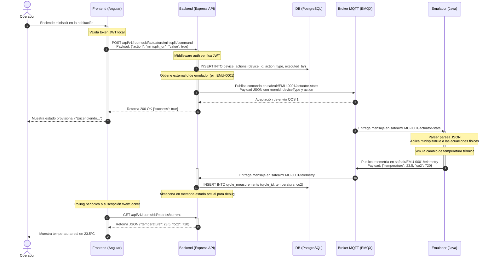

# Arquitectura de Red y Flujo de Datos - SafeAir

Este documento especifica la arquitectura física y lógica de la solución SafeAir, detallando las tecnologías, los puertos reales de comunicación y los flujos de mensajería sincrónicos y asincrónicos.

---

## 1. Stack Tecnológico Confirmado

A partir de los archivos de configuración del proyecto (`package.json`, `pom.xml` y `docker-compose.yml`), se confirman las siguientes tecnologías y versiones:

* **Frontend**: Aplicación SPA desarrollada en **Angular 19** con **TypeScript**. En el entorno de contenedor Docker, se compila para producción y se sirve utilizando **Nginx 1.27-alpine** (expone el puerto local `8080`).
* **Backend API**: Servicio RESTful y cliente MQTT desarrollado en **Node.js** utilizando el framework web **Express 5.2.1** con **TypeScript**. La interacción y mapeo relacional con la base de datos se realiza con el ORM **Sequelize 6.37.8** sobre el controlador nativo de PostgreSQL (`pg 8.20.0`). Expone el puerto `3000`.
* **Broker de Mensajería MQTT**: Intermediario **EMQX** (imagen Docker `emqx/emqx:latest`). Actúa como el broker centralizado que orquesta la mensajería Pub/Sub.
* **Base de Datos**: Motor de base de datos relacional **PostgreSQL 16** (imagen Docker `postgres:16`).
* **Emulador de Dispositivos**: Aplicación de simulación matemática escrita en **Java 17** utilizando **Spring Boot 3.3.0**, y conectada al broker mediante el cliente MQTT Eclipse Paho (`1.2.5`) y buffers de serialización de Google Protobuf (`3.25.3`). Expone el puerto local `8081` para depuración.

---

## 2. Mapa de Puertos y Enrutamiento Físico en Red

El siguiente diagrama detalla la configuración de puertos y protocolos expuestos por el entorno orquestado de Docker Compose:

```
                      INTERRUPTOR DE RED LAN (WIFI / ETHERNET)
                                       │
            ┌──────────────────────────┼──────────────────────────┐
            ▼ (Puerto 8080)            ▼ (Puerto 3000)            ▼ (Puerto 18083)
     ┌──────────────┐           ┌──────────────┐           ┌──────────────┐
     │   Frontend   │           │   Backend    │           │ EMQX Console │
     │  (Angular)   │           │ (Express 5)  │           │ (Dashboard)  │
     └──────────────┘           └──────────────┘           └──────────────┘
            │                          │                          │
   [Red Docker Bridge: safeair-network]───────────────────────────┘
            │                          │                          │
            ▼ (Puerto 6543:5432)       ▼ (Puerto 1883/8084)       ▼ (Puerto 8081:8080)
     ┌──────────────┐           ┌──────────────┐           ┌──────────────┐
     │ Base de Datos│           │ Broker MQTT  │           │   Emulador   │
     │ (Postgres 16)│           │    (EMQX)    │           │ (Spring Boot)│
     └──────────────┘           └──────────────┘           └──────────────┘
```

### Tabla de Puertos del Contenedor vs. Host
| Servicio | Imagen Docker | Puerto Interno | Puerto Host | Protocolo / Propósito |
|----------|---------------|----------------|-------------|-----------------------|
| `frontend` | `node:20` + `nginx` | `80` | `8080` | HTTP (Servicio de UI Angular) |
| `frontend` | `node:20` + `nginx` | `443` | `8443` | HTTPS (Seguridad opcional SSL) |
| `api` | `node:20-alpine` (Express) | `3000` | `3000` | HTTP (API REST de SafeAir) |
| `db` | `postgres:16` | `5432` | `6543` | PostgreSQL (Persistencia relacional) |
| `mqtt` | `emqx/emqx:latest` | `1883` | `1883` | MQTT TCP (Conexión de emuladores) |
| `mqtt` | `emqx/emqx:latest` | `8883` | `8883` | MQTT sobre TLS (Producción segura) |
| `mqtt` | `emqx/emqx:latest` | `8084` | `8084` | MQTT WebSockets (Suscripciones frontend) |
| `mqtt` | `emqx/emqx:latest` | `18083` | `18083` | HTTP (Consola administrativa EMQX) |
| `emulator` | `maven` + `openjdk:17` | `8080` | `8081` | HTTP (Debug de variables en emulador) |

---

## 3. Diagrama de Secuencia y Flujo de Eventos

El siguiente diagrama detalla paso a paso el flujo de datos que ocurre cuando un operador modifica un actuador en la interfaz de usuario, demostrando cómo se sincronizan el canal HTTP REST y la comunicación distribuida de eventos MQTT:


